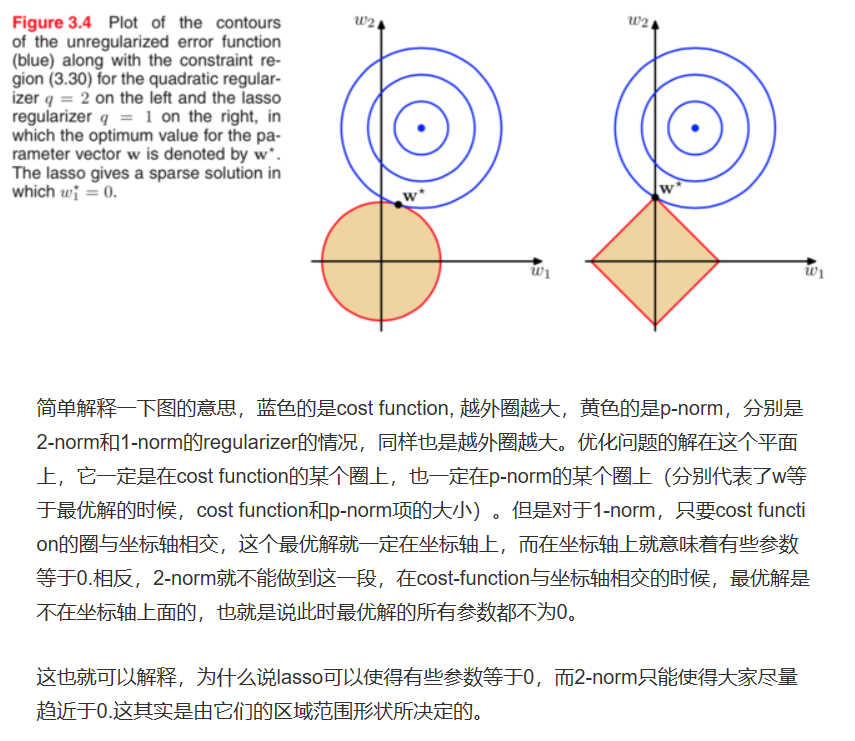
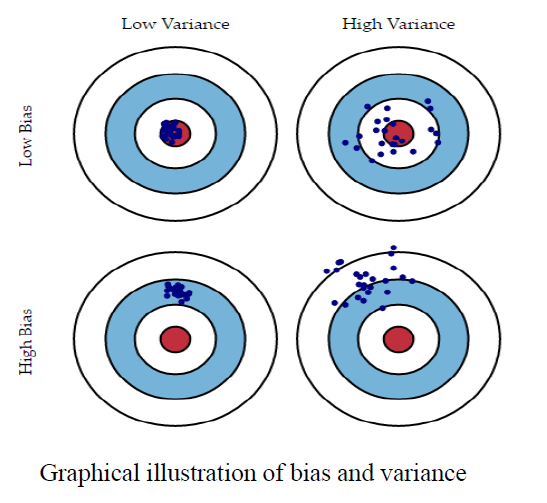
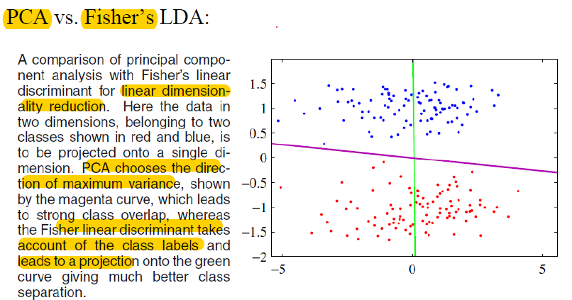
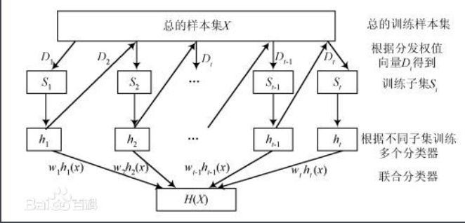
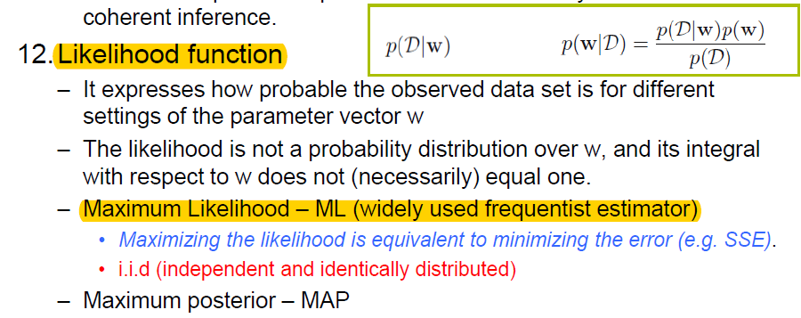
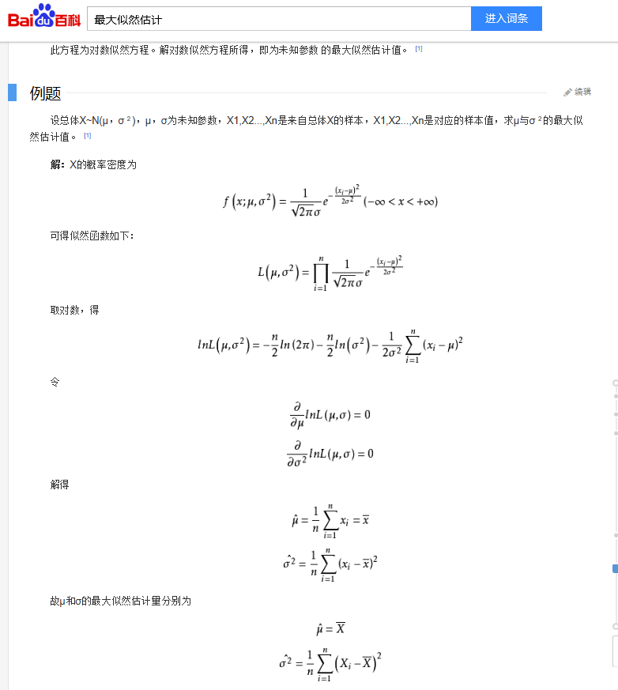
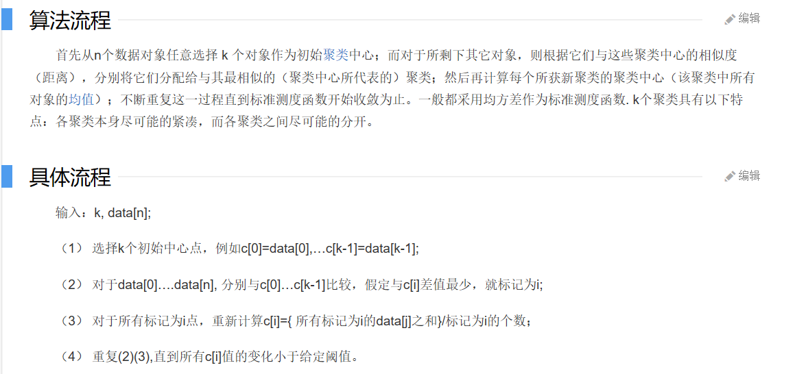
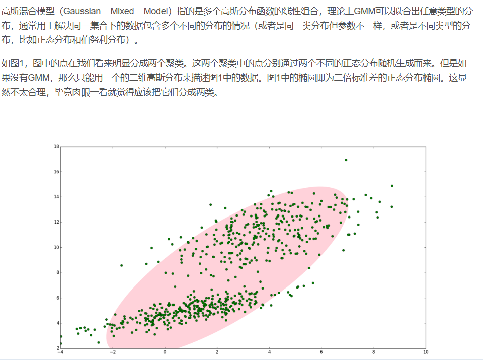

# AI2018 Checklist
forked from Toni Chan

modified by laylalaisy

# A. SEARCH

## 1. Uninformed Search, Heuristic Search

- Search Establishment
    - Goal
    - Goal Formulation: current step
    - Problems Formulation: actions to goal
    - Search: looking for actions
    - Execution: take action

- Uninformed: no guidance, informed: yes
- Types
    - Deterministic, fully observable
    - Non-observable
    - Non-Deterministic/Parcially observable
    - Unknown state space

- Well-defined search problems:
    - Initial state
    - Actions
    - Transition model
        - State space, directed networks and paths
    - Goal test
    - Path cost

- Formulations: incremental(starting from zero), complete-state(starting from end)

- Tree search; Graph search: add explored set

- node DS: state, parent, action, cost

- Measuring performance: completeness, optimality, time, space

- Uninformed search
    - BFS(FIFO): reaches all finite states, ^depth time, ^depth space, optimal at cost=1(=Uniform cost) while not general
    - DFS(LIFO): not complete and fails in infinite state, ^depth time, *depth space, not optimal 
        - can set limit to depth: DLS
        - Iterative-deepening: auto set new limits

- Informed: heuristic
    - Best-first: evaluation function f as cost estimate to to first expand
        - heuristic functions: calc by current state, f=h then greedy
        - A* search: f = g(cost) + h(estimate)
            - to reach optimal: admissibility(never overestimate), consistency(h adheres to triangularity; consistency->admissibility)

## 2. Adversarial Search: MinMax, Evaluation funcs, Alpha-Beta Search, Stochastic

- Game
    - Initial state
    - Players
    - Actions
    - Results: transition model of a move
    - Terminal-tests: when the game ends
    - Utility: player's final score

- MINMAX
    - Determined by minimax value; max want to maximize value, min want to minimize value
    - complete if finite; optimal against optimal opponent; dfs time-space
    - impractical: limit depth/alpha-beta pruning/no exhaustive search

- **Alpha-beta Pruning** (https://blog.csdn.net/baixiaozhe/article/details/51872495)
    - a: begin at -inf, highest max-node utility that search has found on the path; if in a min node, successors has utility<=a, then prune
    - b: begin at +inf, lowest min-node utility that has found; if in a max node, successors has utility>=b, then prune
    - at time of convergence to no overlap: prune
    - highly dependent on move ordering: try to examine the potentially best successors
    - timing ^depth/2 at best-first, ^3depth/4 at random

# B. STATISTICAL LEARNING

## 3. Probability Theory, Model Selection, Curse of Dimentionality, Decision Theory, Information Theory, Probability Distribution

- Supervised & Unsupervised
    - Supervised: training data with known input-target vector pairs
        - Classification
        - Regression
    - Unsupervised: training data only with input vectors, no targets
        - Density estimate
        - Clustering
        - Hidden Markov Models
    - Reinforcement learning: find suitable actions to take in given situations to maximize reword; discover best results by trial-error; tradeoff between exploration & exploitation **??**

- Model comparison/selection
    - training data
    - validation set
    - model select with min error or validation set
    - use S-fold cross-validation on limited data

    

- Error functions: Sum-of-Square Error/Root-Mean-Square Error

- Dealing overfitting
    - more data
    - regularization: penalty
    - bayesian: prior
    - cross-validation

    

- Curse of Dimensionality: too many variables

- Rules of probability: sume, product, Bayes' Theorem
    - p(Y|X) * p(X) = p(X,Y) = p(X|Y) * p(Y)

- Expectitaion, multiple variables, conditional expectation, variance, covariance

- Gaussian Distribution 
    - **See Formulas**

- Maximum Likelihood Estimator for Variance is Biased: underestimate

- Curve fitting: probabilistic perspective 
    - Express uncertainty over the value of target variable by probability distribution;
    - More Bayesian approach: maximizing posterior distribution = minimizing regularized sum-of-squares error
    - Full Bayesian approach: **formulas**
    - Conjugacy: choose a prior, then posterior distribution has same functional form **??**

- Decision Theory 
    - misclassification rate: p(mistake)=p(false pos)+p(miss)
    - minimize expected loss: sum of posterior class probabilities
    - reject option: introduce threshold theta for probabilities
    - Inference & Decision: inference stage - decision stage: discriminant function
    - Three distinct approaches:
        - first solve inference problem of class-condition densities individually, separately infer prior class probabilities; then use bayes find posterior class probabilities: generative models
            - Demanding, may need large training set
            - allows marginal density of data to be determined from, helpful to detect new data of low probability
        - first solve inference problem of posterior class probabilities, then use decision theory to assign each new x to one of the classes: discriminative models
            - no waste of computational resources
        - find a function(discriminant function) mapping each x onto a class label: no probability role.
            - combining inference and decision into single problem

- Information theory: entropy
    - h(x) = -log p(x); H(x) = -Sum(x):p(x)logp(x)
    - lower probability: higher info content
    - nonuniform distribution has smaller entropy than uniform ones
    - entropy is a lower bound of number of bits to transmit state of random variable: Shannon
    - distributions sharply peaked around a few values will have low entropy
    - max entropy configuration: use Lagrange multiplier enforce normalization constraints: then p(x)=1/M, M total number of states;  H=lnM
    - relative entropy: calc(dx):p(x)ln(q(x)/p(x))
    - mutual information: calccalc(dx,dy):p(x,y)ln(p(x)p(y)/p(x,y)) = H(x) - H(x|y) = H(y) - H(y|x)

- Gaussian Distribution - continued 
    - single & multivariate
    - mahalanobis/euclidean distance
    - jacobian factor/matrix **??**
    - expectation: still μ's matrix
    - second order moments: covariance: Σ matrix
    - μ has D paramters, Σ has D(D+1)/2 (D for dimensions)
    - Σ=diag(σi^2): mutually independent, 2D parameters; Σ=σ^2I: isotropic, D+1 parameters
    - Partitioned Gaussians **??** : marginal=single gaussian with μa,Σaa
    - Bayes: **Formulas**
    - Maximum Likelihood: **Formulas** E(μML)=μ, E(ΣML)=N-1/N*Σ
        - Bayesian Treatment: Know σ^2 for μ; Know μ for σ^2; for both
            - Know σ^2 for μ: **Formulas**
            - Know μ for σ^2: **Formulas** Gamma Distribution
            - For both: Normal-Gamma/Gaussian-Gamma

- Non-Parametric methods
    - P = calc(at R,dx):p(x): p(x) = K/NV 
    - Kernel density estimator: fix V check K 
        - Parzen Window **??**
    - K-nearest-neighbor: fix K check V
        - density estimation: K goven radius of sphere

## 4. Linear Models for Regression: Linear Basis Function Models, Bias-Variance Decomposition

- Linear regression: y(x,w) = sum(i):w_0+w_i*x_i
    - Linear basis function model: linear combinations of mixed non linear functions of input variables
        - Polynomial, Gaussian, sigmoid, Fourier
    - Maximal likelihood; Least Squares: **Formulas** **??**
        - Bias compensates for difference between averages of target values and weighted sum of averages of basis function values
        - Geometric interpretation of least-squares: finding orthogonal projection of data vector onto subspace spanned by basis functions
    - Gradient Descent: if function J(w) is defined and diffrentiable in neighborhood, then J(w) decreases fastest if one goes from w0 in direction of negative gradient of J at w0: -J'(w0)
        - stochasticL w(t+1) = w(t) - learning rate*delta(Error Function)
        - LMS: functions
    - Regularized least squares: **??**
        - weight decay

        - Regularizer: lasso = sparse model, q = 1; quadratic, q = 2(https://www.jianshu.com/p/16ea152d5edf)

          

        - regulaization: allows complex models to be trained on limited data without overfitting

        
    - Multiple output: **Formulas**

- Bias-Variance Decomposition
    - Error due to Bias: difference of expected prediction and correct value; underfitting
    - Error due to Variance: variability of a model prediction for a given data point; overfitting
    - Err(x) = Bias^2 + Variance + Irreducible error
    - Trade-off: minimizing Err(x)

    

## 5. Linear Models for Regression: Basic Concepts

- Concepts
    - Decision regions: input space divided
    - Decision boundaries: linear-linear function of input sector x; (D-1)-dim hyperplane within D-dim input space
    - Datasets whose classes can be separated exactly by linear decision surfaces

- Representation of Class Labels
    - 1-hot vectors
    - y(x) = f(w^T*x+w0): f as activation function, f^-1 as **link function**

- Approaches of classification
    - Discriminant function: no compute possibilities
        - Least-squares: model predictions as close as possible to a set of targets
        - Fisher's linear discriminant: maximum class separation in output space
        - Perceptroon algo of Rosenblatt: generalized linear model

        
    - Generative approach
        - model class-conditional densities and class priors
        - compute posterior probabilities thru bayes

        
    - Discriminative approach
        - model posteriors directly, and optimaize parameters using training set(logistic regression, etc)

## 6. K-means Clustering, GMM, EM, Boosting

- K-means Clustering
    - Goal: finding assignment of point clusters according to some objective function
    - Algorithm: P
        - Pick random k; 
        - Random scatter cluster centers; 
        - Repeat
            - Assign each data point to closest cluster center
            - Move each center to the mean of points assigned
    - Distance: J = sum(n):sum(k):rnk||xn-μk||^2
    - Online: μk = sum(n):rnk*xn / sum(n): rnk; μknew = μkold + yn(xn-μkold) - nearest prototype to xn
    - K-medoids: work with other distance matrix other than Euclid
    - Limitations: only converge to local minimuml not considering data density and probabilistic distribution

- Mixtures of Gaussians
    - **Formulas**
    - Difficulty of GMM by ML: singularities; identifiability; no closed form solution

- Expectiation-Maximization algorithm
    - For GMM: use responsibility
        - Initialize means μ, covariances Σ, mixing coefficients π, and evaluate initial value of log likelihood
        - E-step: evaluate responsibilities using current parameter values;
        - M-step: re-estimate parameters using current possibilities;
        - Evaluate log likelihood and check for convergence of either parameters or log likelihood; criterion not satisfied return to 2
    - Alternative view of EM
        - Goal: find maximum likelihood solution for models having high latent variables
    - General: distribution p(X,Z|θ) over observed vars X and latent Z, parameter θ, to maximize p(X|θ) for θ.
        - Choose initial setting of parameters θold;
        - E-step: evaluate p(Z|X, θold);
        - M-step: evaluate θnew by argmax Q(θ,θold) = sum(Z):p(Z|X, θold)ln(p(X,Z|θ));
        - Check convergence of log likelihood/parameter values; convergence criterion not satisfied then replace and return to 2
    - **Formulas**
    - Relation to K-means **???**
    - Boosting（http://www.360doc.com/content/16/0420/15/2036337_552310509.shtml）：

    

# C. NEURAL NETWORKS

## 7. Stochastic Gradient Descent, BackPropagation, FeedForward Neural Networks

- Neural Networks
    - A neuron: input links; input function; activation function; output; output links
    - Activation functions: sigmoid/logistic, tanh, ReLU
    - Building: select structures(Feed-forward, recurrent); select weights(by training and learning)
        - collection fo acyclic graph: layerwise
        - common: fully-connected layers
    - Perceptron networks: 1 layer FFNN, no hidden
        - Multilayer perceptrons
        - Hebbian theory
    - Representation power: NN with Fully connected layers are universal approximators, approx any continuous func
        - mathly sound, but weak
        - layers increase, capacity increase

- Optimization & Gradient Descent
    - Random search: slow, not accurate
    - Gradient: vectors along each dimension
        - numerical: approximate, slow; analytic: exact, fast. always use analytic, but use numeric to check correctness
        - stochastic: using minibatch

- BackProp: computing gradients of expressions thru recursive application of chain rule
    - computational graph
        - allow simple functions form complex models
        - auto differentiation
    - Forward pass: traverse in topological order, fill values; Backward pass: traverse reversed, calculate deriatives at each node, and add by learning rate
    - **Examples**

## 8. Convolutional NN

- Architecture(https://blog.csdn.net/yjl9122/article/details/70198357)

    

    - Convolutional layer: filter as weighted sum
        - strides: do once every n move. output size: **(N-F)/Stride + 1**
        - practice: zero pad borders
        - number of weights: filter size * dimentions * filter number; number of bias: filter number
    - Pooling layer: downsample and reduce parameters and control overfitting
        - usually choose MAX function
    - Normalization layer: implementing inhibition schemes. obsolete
    - Fully connected layer: regular fully connected activations, compute with matrix multiplication, follow by bias offset

- Reducing overfitting
    - Data augmentation: image translations, alter RGB intensities, PCA, multiples of principal components
    - Dropout: reduce complex co-adaptations; zero output neuron output at 50% Can used to boost performance.

    - Transfer learning
        - Train on whole
        - Small dataset: feature extractor
        - Medium dataset: fine tuning

- Application
    - Classification
    - CV Tasks
        - Semantic segmentation: no objects
        - Classification + localization: single object
            - Aside: Human pose estimation
        - Object detection, instance segmentation: multiple objects

## 9. Recurrent NN: Vanilla, LSTM, GRU

- RNN: a family of neural networks for processing sequential data
    - recurrence formula: ht = fW(ht-1,xt)
    - Vanilla RNN: ht = tanh(Whh * ht-1 + Wxh * xt), yt = Why * yt, softmax output
        - exploding/vanishing gradients: gradient clipping
    - Reuse same weight matrix at every time-step
    - Compute loss: backpropagation thru time; Forward thru entire sequence to compute loss, then backward thru entire sequence to compute gradient
        - Truncated BP: do forward and backward pass part by part
    - How to train: Backprop
        - take derivative of loss with respect to each parameter
        - shift parameters in opposite direction 
        - Hard to train: vanishing gradient
        - gradient flow: not trained to capture long-term dependencies, depend on few words

- Usages
    - Seq2Seq: machine translation: *I-*O, not same time
    - Visual Q-A
    - Image captioning: 1I-*O, CNN+RNN
        - Attention: weighed combination of features; distribution over L locations
    - Video action classification
    - Image Classification: 1I-1O
    - Sentiment Analysis: *I-1O
    - Videl Storyline: *I-*O, same time
    - Character generation: feed back to model

- Multilayer RNNs
- Bidirectional RNNs
- LSTM
    - **i**mput, **f**orget, **o**output, **g**ate
    - **Graph**
        (i,f,o,g)^T = (σ,σ,σ,tanh)^T * W * (ht-1,xt)^T
        ct = f · ct-1 + i * g
        ht = o · tanh(ct)    
    - additive update function for cell state has better behaved derivative
    - gating functions allow network to decide how much vanishes, and take different values at each time step; values are learnt functions of current input and hidden state
- GRU
    - single gating unit simultaneously control forgetting factor and decision to update state unit
    - reset and update gates individually "ignore" parts of state vector; update gate either copy or ignore with new targeet state value; reset gate control which part of state get used to compute the next target state

https://zh.wikipedia.org/wiki/梯度下降法

